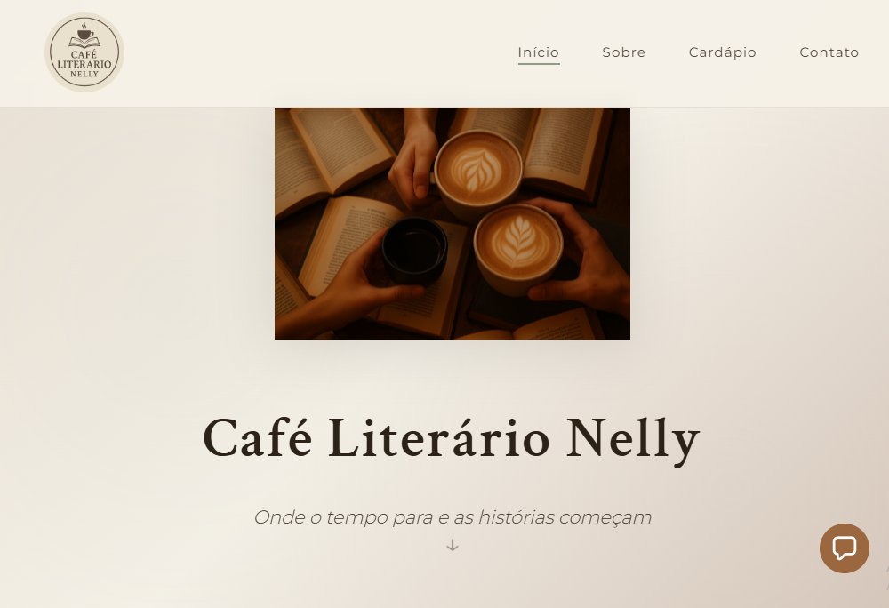
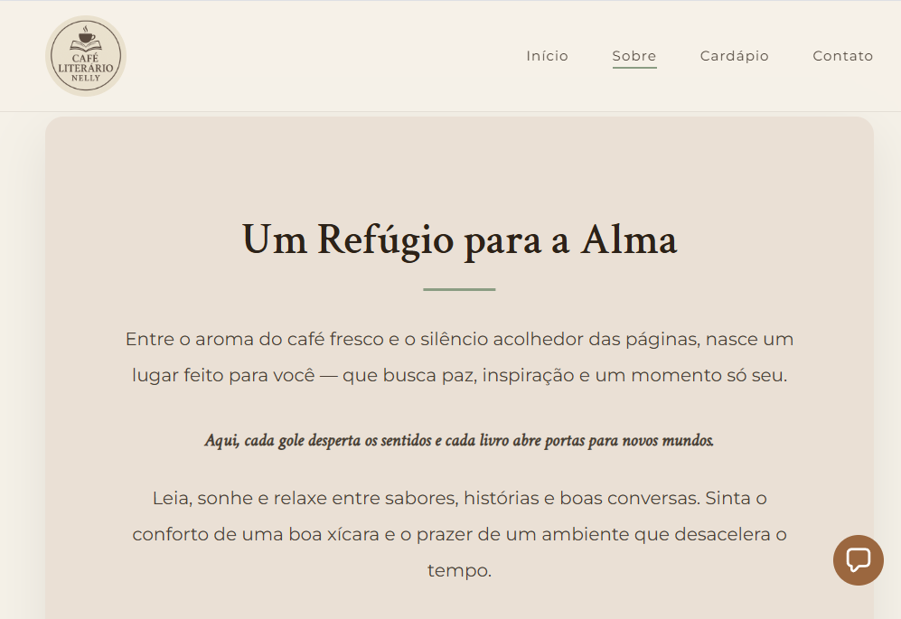
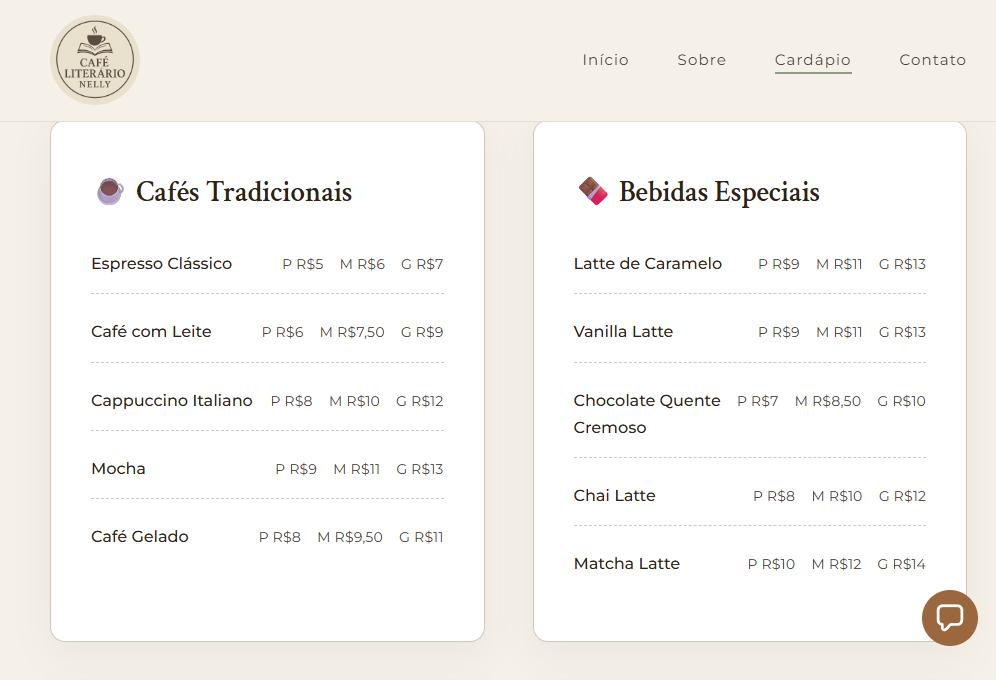

<!DOCTYPE html>
<html lang="pt-BR">
<head>
    <meta charset="UTF-8">
    <meta name="viewport" content="width=device-width, initial-scale=1.0">
    <title>README - Café Literário Nelly</title>
    
</head>
<body>
    

        <header>
            <h1>☕ Café Literário Nelly</h1>
            
Onde o tempo para e as histórias começam

            

                ✅ Status: Concluído
                📱 Responsivo
                🎨 Design Moderno
                ⚡ Performance
            

        </header>
        
        

            <h2>📖 Sobre o Projeto</h2>
            

                O <strong>Café Literário Nelly</strong> é um website elegante e acolhedor desenvolvido para uma cafeteria que une o prazer do café com o amor pela leitura. O projeto apresenta uma experiência visual imersiva com design responsivo, animações suaves e uma paleta de cores inspirada em ambientes literários clássicos.
            

            
            <h2>📸 Prévia do Projeto</h2>
            

                

                    
                    
Página Inicial - Hero Section

                

                

                    
                    
Cardápio Completo

                

                

                    
                    
Versão Mobile Responsiva

                

            

            
            <h2>✨ Características Principais</h2>
            

                

                    
🎨

                    <h3>Design Sofisticado</h3>
                    
Paleta de cores em tons terrosos inspirados em cafeterias clássicas

                

                

                    
📱

                    <h3>Responsivo</h3>
                    
Adaptado para todos os dispositivos e tamanhos de tela

                

                

                    
🎭

                    <h3>Animações</h3>
                    
Transições suaves e efeitos de scroll elegantes

                

                

                    
📍

                    <h3>Localização</h3>
                    
Integração com Google Maps para fácil localização

                

            

            
            <h2>🛠️ Tecnologias Utilizadas</h2>
            <table class="tech-table">
                <thead>
                    <tr>
                        <th>Tecnologia</th>
                        <th>Descrição</th>
                    </tr>
                </thead>
                <tbody>
                    <tr>
                        <td><strong>HTML5</strong></td>
                        <td>Estrutura e marcação semântica do documento</td>
                    </tr>
                    <tr>
                        <td><strong>CSS3</strong></td>
                        <td>Estilização avançada, animações e responsividade</td>
                    </tr>
                    <tr>
                        <td><strong>JavaScript</strong></td>
                        <td>Interatividade, menu hambúrguer e animações de scroll</td>
                    </tr>
                    <tr>
                        <td><strong>Google Fonts</strong></td>
                        <td>Tipografias Crimson Text e Montserrat</td>
                    </tr>
                    <tr>
                        <td><strong>Google Maps API</strong></td>
                        <td>Integração de mapa para localização</td>
                    </tr>
                </tbody>
            </table>
            
            <h2>🚀 Como Executar o Projeto</h2>
            <h3>1. Clone o repositório</h3>
            
git clone https://github.com/danielly-pedrini/cafe-literario-nelly.git cd cafe-literario-nelly

            
            <h3>2. Estrutura de arquivos</h3>
            
cafe-literario-nelly/ │ ├── index.html ├── styles.css ├── img/ │   ├── logo.png │   └── cafe-literario.png └── README.md

            
            <h3>3. Execute o projeto</h3>
            
Abra o arquivo <strong>index.html</strong> no seu navegador favorito ou use uma extensão como Live Server no VS Code.

            
            <h2>🎨 Paleta de Cores</h2>
            

                

                    

                    

                        <strong>Bege Claro</strong> #EAE0D5
                    

                

                

                    

                    

                        <strong>Bege</strong> #D4C5B9
                    

                

                

                    

                    

                        <strong>Marrom</strong> #4A3F35
                    

                

                

                    

                    

                        <strong>Marrom Escuro</strong> #2C2218
                    

                

                

                    

                    

                        <strong>Verde Suave</strong> #8B9D83
                    

                

                

                    

                    

                        <strong>Creme</strong> #F5F1E8
                    

                

            

            
            <h2>🎯 Funcionalidades</h2>
            <ul class="checklist">
                <li>Header fixo com navegação suave entre seções</li>
                <li>Seção Hero com animações flutuantes</li>
                <li>Página "Sobre" com texto acolhedor e elegante</li>
                <li>Cardápio completo organizado por 6 categorias</li>
                <li>Sistema de preços por tamanho (P/M/G) para bebidas</li>
                <li>Footer com informações de contato completas</li>
                <li>Mapa interativo do Google Maps</li>
                <li>Animações de entrada ao fazer scroll</li>
                <li>Menu hambúrguer responsivo para mobile</li>
            </ul>
            
            <h2>📱 Responsividade</h2>
            
O site é totalmente responsivo com breakpoint em <strong>768px</strong>, incluindo:

            <ul class="checklist">
                <li>Menu hambúrguer animado para dispositivos móveis</li>
                <li>Layout em coluna única no mobile</li>
                <li>Tamanhos de fonte adaptados</li>
                <li>Imagens redimensionadas automaticamente</li>
            </ul>
            
            <h2>🗂️ Categorias do Cardápio</h2>
            

                

                    
☕

                    
<strong>Cafés Tradicionais</strong>

                

                

                    
🍫

                    
<strong>Bebidas Especiais</strong>

                

                

                    
🧁

                    
<strong>Bolos & Doces</strong>

                

                

                    
🥐

                    
<strong>Salgados</strong>

                

                

                    
🥤

                    
<strong>Bebidas Frias</strong>

                

                

                    
🌿

                    
<strong>Especiais da Casa</strong>

                

            

            
            <h2>🌟 Melhorias Futuras</h2>
            <ul class="checklist future">
                <li>Sistema de reservas online</li>
                <li>Galeria de fotos do café</li>
                <li>Blog com artigos sobre café e literatura</li>
                <li>Integração com redes sociais</li>
                <li>Newsletter para clientes</li>
                <li>Sistema de avaliações</li>
                <li>Modo escuro (Dark mode)</li>
                <li>Internacionalização (i18n)</li>
            </ul>
            
            

                <h3>📧 Contato do Estabelecimento</h3>
                
📍 Rua dos Livros, 123 - Centro, Porto Feliz - SP

                
🕐 Segunda a Sábado: 8h às 20h | Domingo: 9h às 18h

                
📞 (15) 3262-0000

            

            
            

                <h2>👩‍💻 Autora</h2>
                <h3>Danielly Pedrini</h3>
                
Desenvolvedora apaixonada por criar experiências web elegantes e funcionais

                

                    <a href="https://github.com/danielly-pedrini" target="_blank">
                        🐙 GitHub
                    </a>
                    <a href="https://www.linkedin.com/in/daniellypedrini/" target="_blank">
                        💼 LinkedIn
                    </a>
                

            

        

        
        <footer>
            
© 2025 Café Literário Nelly — Desenvolvido com ☕ e 📚 por Danielly Pedrini

            
⭐ Se este projeto te ajudou, considere dar uma estrela no GitHub!

        </footer>
    

</body>
</html>